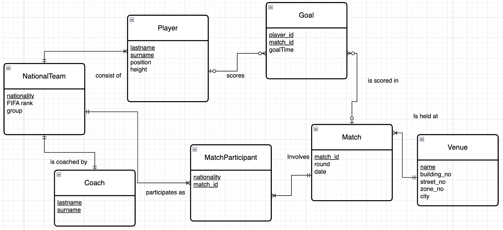

---

# ⚽ FIFA World Cup 2022 Database (PostgreSQL)

A relational database project modeling the **FIFA World Cup Qatar 2022**, designed and implemented using **PostgreSQL**.
This project focuses on **proper relational modeling, normalization, foreign key design**, and **realistic football match data analysis**, including **penalty shootouts**.

---

## 📌 Overview

This database models key entities and relationships of the FIFA World Cup 2022:

* National teams and players
* Matches and venues
* Goals (regular time & penalty shootouts)
* Match participation and outcomes

Special attention was given to **data integrity**, **foreign key consistency**, and **real-world constraints**, such as:

* One team per coach
* Exactly two teams per match
* Penalty shootouts are distinguished by a special value in `goalTime`:
- Regular goals: minute value (e.g. `45`, `90+2`)
- Penalty shootouts: `'PK'`


---

## 🧩 Entity Relationship Diagram (ERD)

The following ERD illustrates the logical structure of the database and its relationships:



* The schema is fully normalized and enforces referential integrity via PK/FK constraints.
* MatchParticipant resolves the many-to-many relationship between Match and NationalTeam.


### Key design highlights

* **MatchParticipant** resolves the many-to-many relationship between `Match` and `NationalTeam`
* **Goal** references both `Match` and `Player`, with nullable player references to allow future extensibility
* **Penalty shootouts** are explicitly distinguished using a boolean flag

---

## 🗂️ Database Schema

### Main Tables

| Table              | Description                               |
| ------------------ | ----------------------------------------- |
| `NationalTeam`     | World Cup participating national teams    |
| `Player`           | Players belonging to a national team      |
| `Coach`            | One-to-one relationship with NationalTeam |
| `Match`            | World Cup matches with round and date     |
| `Venue`            | Stadium information                       |
| `MatchParticipant` | Teams participating in each match         |
| `Goal`             | Goals scored in matches (regular & PK)    |

---

## 🏗️ Design Decisions

### 1. **Penalty Shootout Modeling**

Instead of mixing penalty shootouts with regular goals:

```sql
is_penalty_shootout BOOLEAN NOT NULL
```

This enables:

* Accurate match result calculation
* Clean separation between match goals and shootouts
* Flexible aggregation queries

---

### 2. **Goal Primary Key Redesign**

Originally, player name was part of the primary key.
This was redesigned to improve normalization and integrity:

```sql
The primary key of `Goal` is a composite key:

(player_lastname, player_surname, match_id, goalTime)

This ensures:
- No duplicate goal events within a match
- Natural uniqueness without introducing surrogate keys

```

Benefits:

* Resolves FK contradictions (`ON DELETE SET NULL`)
* Allows anonymous or future goal events
* Cleaner indexing and joins

---

### 3. **Coach Relationship Simplification**

Each team has exactly **one coach**:

```sql
Coach(team_nationality PK → NationalTeam)
```

This avoids circular dependencies and simplifies inserts.

---

## 📊 Example Queries

### Total goals by team (excluding penalty shootouts)

```sql
SELECT
    p.nationality,
    COUNT(g.goal_id) AS total_goals
FROM Goal g
JOIN Player p
  ON g.player_lastname = p.lastname
 AND g.player_surname = p.surname
WHERE g.is_penalty_shootout = FALSE
GROUP BY p.nationality
ORDER BY total_goals DESC;
```

---

### Match results including penalty shootouts

A database view is provided:

```sql
SELECT * FROM match_results_with_pk;
```

This view:

* Aggregates goals per team
* Handles penalty shootouts correctly
* Determines match winners automatically

---

## 📁 Project Structure

```text
.
├── 01_drop.sql              -- Drop existing tables/views
├── 02_schema.sql            -- Database schema (DDL)
├── 03_seed_master.sql       -- Master data (teams, venues, coaches)
├── 04_seed_facts.sql        -- Match, player, and goal data
├── 05_views.sql             -- Analytical views
├── README.md
└── ERD.png
```

---

## 🚀 How to Run

```bash
psql -d fifa_wc2022 -f 01_drop.sql
psql -d fifa_wc2022 -f 02_schema.sql
psql -d fifa_wc2022 -f 03_seed_master.sql
psql -d fifa_wc2022 -f 04_seed_facts.sql
psql -d fifa_wc2022 -f 05_views.sql
```

---

## 🎓 Academic Context

* **Course**: Database Systems
* **Assessment Type**: Relational Database Design & SQL Queries
* **Focus Areas**:

  * Normalization
  * Referential integrity
  * Complex joins and aggregation
  * Real-world data modeling

---

## 💡 What This Project Demonstrates

* Strong understanding of **relational database design**
* Ability to **identify and resolve schema inconsistencies**
* Practical SQL skills beyond textbook examples
* Clean separation between **conceptual design (ERD)** and **implementation (DDL)**

---

